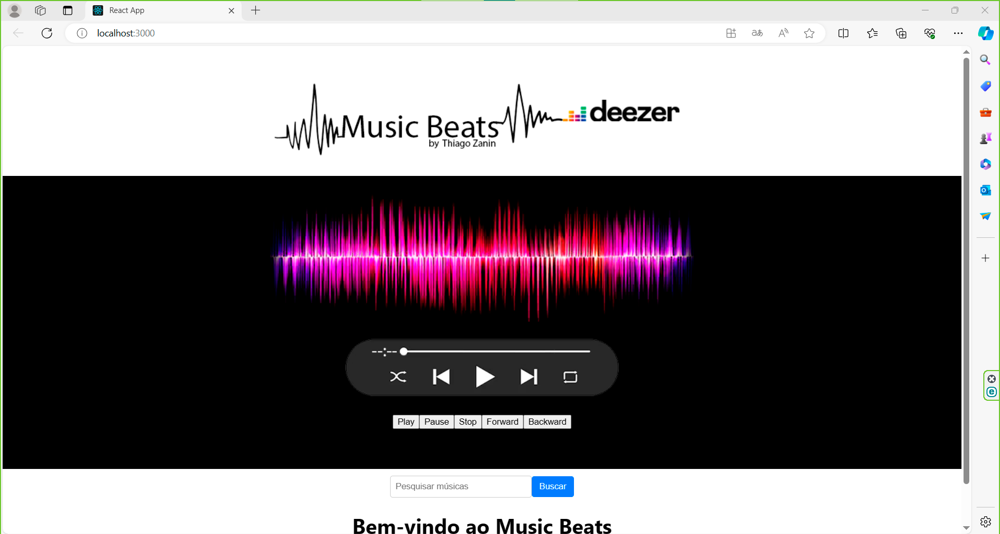

# Music Beats app

Este projeto é um aplicativo de música em desenvolvimento utilizando React e a API do Deezer para fornecer funcionalidades relacionadas à música.

## Tecnologia

Aqui estão as tecnologias usadas neste projeto:

- React
- JavaScript
- HTML
- CSS

## Funcionalidades

As principais funcionalidades do aplicativo são:

- Reproduzir músicas do Deezer.
- Buscar músicas e artistas.
- Controles de reprodução: reproduzir, pausar, avançar, retroceder.
- Visualizar informações sobre a música em reprodução.

## Como Usar

1. Clone o repositório para a sua máquina local.
2. Certifique-se de ter o Node.js e o npm instalados.
3. Navegue até o diretório do projeto e execute `npm install` para instalar as dependências.
4. Execute `npm start` para iniciar o servidor de desenvolvimento.
5. Abra o seu navegador e acesse a aplicação em http://localhost:3000.
6. Interaja com a aplicação para reproduzir músicas e explorar funcionalidades.

## Contribuição

Sinta-se à vontade para contribuir com melhorias ou correções de bugs. Basta abrir uma issue ou enviar um pull request.

## Autor

Thiago Zanin

## Agradecimentos

Obrigado por visitar meu projeto e pelo interesse em contribuir para o seu desenvolvimento!

---

*Este aplicativo está em desenvolvimento e qualquer ajuda é bem-vinda. Se você estiver disposto a contribuir, sinta-se à vontade para entrar em contato.*

